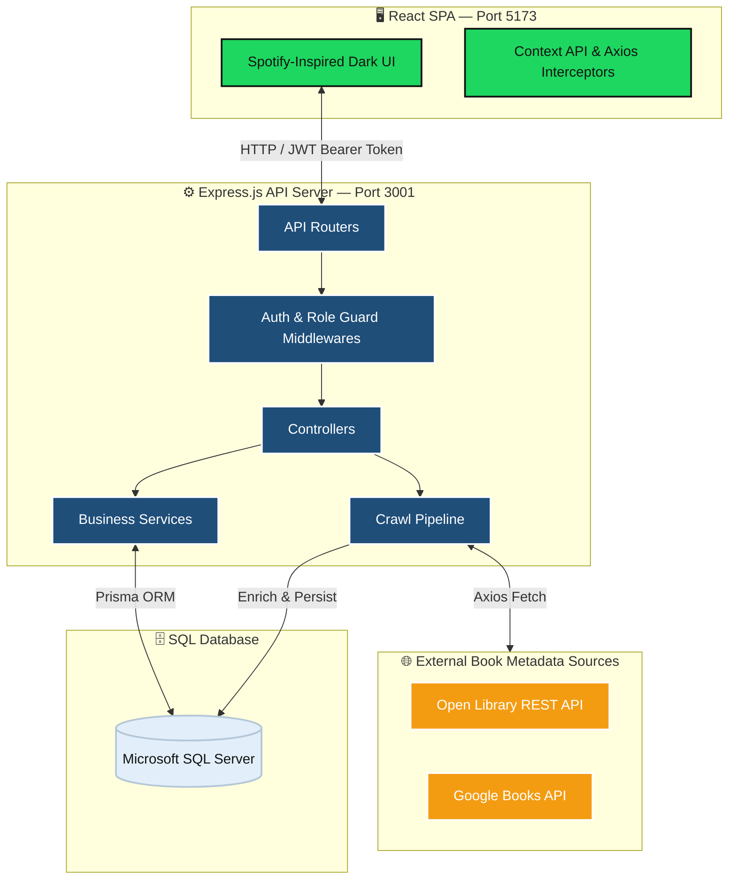
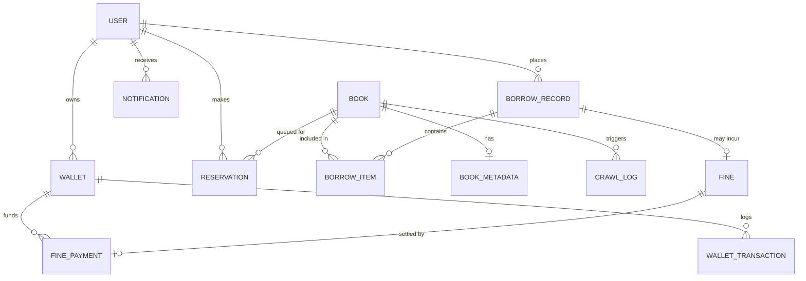
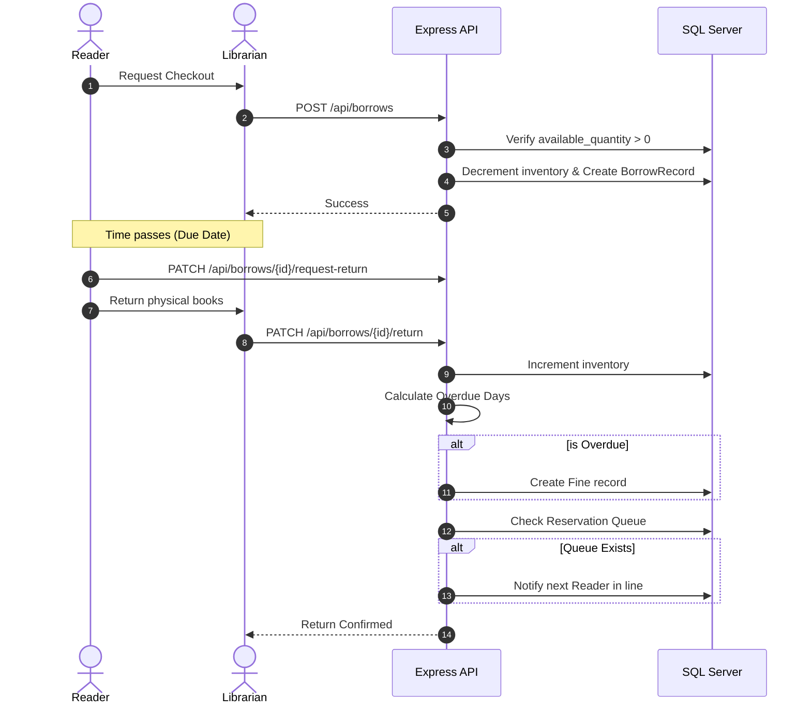
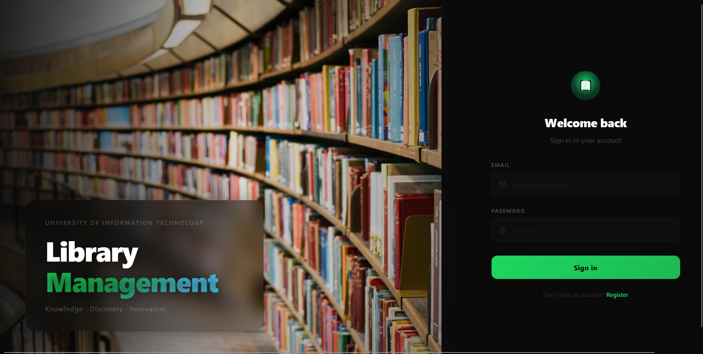

# 📚 LibraryLMS — Client-Server Library Management System


> **SE104 — Introduction to Software Engineering**
> University of Information Technology (UIT)
>
> A production-grade, Client-Server web application designed to digitize core library operations. Features a **Spotify-inspired dark UI**, a **multi-source metadata enrichment pipeline**, an **integrated digital wallet & payment system**, and **priority-based book reservation queues**.

---

## 📖 Table of Contents

1. [Project Overview](#-project-overview)
2. [System Architecture](#-system-architecture)
3. [Technology Stack](#-technology-stack)
4. [Aesthetics & Design System](#-aesthetics--design-system)
5. [Database Schema](#-database-schema)
6. [Core Features](#-core-features)
7. [Project Structure](#-project-structure)
8. [Installation & Setup](#-installation--setup)
9. [API Endpoint Reference](#-api-endpoint-reference)
10. [Architecture Decision Records & Implementation Rules](#-architecture-decision-records--implementation-rules)

---

## 🎯 Project Overview

**LibraryLMS** is a full-stack Client-Server web application built for the **SE104 (Introduction to Software Engineering)** course at **UIT**. It digitizes the day-to-day operations of a university or community library — covering account management, book catalogue control, borrow/return transactions, automated fine handling, digital wallet top-ups, book reservations, and real-time dashboard analytics.

### Target Users & Roles

| Role | Access Level | Responsibilities |
| :--- | :--- | :--- |
| **Librarian** (Staff / Admin) | Staff Dashboard | Book catalogue CRUD, member management, issuing borrows, processing returns, managing fines, reviewing crawl logs |
| **Reader** (Student / Patron) | Reader Dashboard | Browse catalogue, view borrow history, manage digital wallet, pay fines, reserve books, receive notifications |

---

## 🏗️ System Architecture

The application follows a classic **Client-Server architecture**, tightly integrating the frontend presentation layer, server-side application logic, and relational data persistence into a single deployable unit.



### Request–Response Lifecycle

1. **Client Request** — The React SPA fires an API request via `axios`. A request interceptor automatically injects the JWT as an `Authorization: Bearer <token>` header on every outbound call.
2. **Routing & Security** — Express maps the incoming route. `authMiddleware` validates and decodes the JWT. `roleGuard` verifies role-based permissions (e.g., a `user`-role request to `/api/users` is rejected with `403 Forbidden`).
3. **Input Validation** — `express-validator` sanitizes and validates query parameters and request bodies, enforcing constraints such as ISBN-13 format and required fields.
4. **Service Delegation** — Controllers remain deliberately thin. All business logic — fine rate calculations, queue priority evaluation, crawl data merging — is encapsulated in dedicated Service modules.
5. **ORM / Database** — Prisma executes type-safe queries against the **Microsoft SQL Server** backend, handling migrations and connection pooling.
6. **Structured Response** — Every endpoint returns a consistent JSON envelope:

```json
{
  "success": true,
  "data": { "...": "..." },
  "message": "Operation successful"
}
```

---

## 💻 Technology Stack

| Layer | Technology | Version | Description | Why Chosen |
| :--- | :--- | :---: | :--- | :--- |
| **Frontend** | **React** | 19.2 | Declarative component UI | Industry standard, predictable state model |
| | **React Router** | 7.15 | Client-side routing | Enables seamless SPA experience without reloads |
| | **Vite** | 8.0 | Bundler and dev server | Sub-second HMR and superior startup time |
| | **Tailwind CSS** | 3.4 | Utility-first CSS | Rapid iteration of dark UI directly in markup |
| | **Axios** | 1.x | HTTP Client | Interceptors elegantly manage JWT injection |
| | **Framer Motion** | 11.x | Animation library | Smooth transitions for a premium, fluid feel |
| **Backend** | **Express.js** | 5.2 | Node.js web framework | Unopinionated, robust middleware support |
| | **Node.js** | 18+ | JavaScript runtime | Unified language across client and server |
| | **Prisma ORM** | 6.19 | ORM | Auto-generated migrations and type-safe queries |
| | **node-cron** | 4.2 | Task scheduler | Automates daily checks for overdue fines |
| **Database** | **SQL Server** | 2019+ | Relational DB engine | Fulfills UIT specs, handles nested queries well |

---

## 🎨 Aesthetics & Design System

The UI is built on a custom **Spotify-inspired dark theme** defined via CSS custom properties in `client/src/index.css`.

### Design Principles

- **Dark Immersive Canvas:** Deep charcoal (`#121212`) and black backgrounds make structural elements visually recede, allowing book artwork to stand out.
- **Spotify Green Accent:** `#1ED760` is exclusively used as the interactive accent (buttons, active states, balances).
- **Pill & Circle Geometry:** Extreme border-radius (`9999px`) for search bars and buttons. No sharp corners on interactive elements.
- **Elevation & Depth:** Drop shadows (`box-shadow`) instead of borders to communicate layer depth (e.g., modals and dropdowns).

---

## 🗄️ Database Schema

The database is designed in **Third Normal Form (3NF)** using Prisma.



### Core Entities

- **User:** Stores credentials and role (`librarian` or `user`).
- **Book & BookMetadata:** Catalogue records (soft-deleted via `is_deleted`) and external crawled data.
- **BorrowRecord & BorrowItem:** Transaction headers and detailed line items for multi-book checkouts.
- **Wallet & Fine:** Digital balance and auto-calculated overdue charges.
- **Reservation:** Queue tracking for out-of-stock books.

---

## ⚡ Core Features

### 1. Multi-Book Borrow & Return Transactions

Librarians can check out up to **3 books per transaction**. Inventory (`available_quantity`) is atomically decremented on checkout and restored upon confirmed return.

#### Borrowing & Return Flow


### 2. Automated Fine Calculation & Digital Wallet

- Fines are dynamically computed at the moment of return (**2,000 VND / overdue day**).
- Readers manage a digital `Wallet`, allowing them to top up and seamlessly pay fines in a single atomic transaction.
- `WalletTransaction` ledgers provide a transparent audit trail.

### 3. Metadata Enrichment Crawl Pipeline

Adding a new book by ISBN-13 triggers a background job merging data from **Open Library** and **Google Books**. Librarians can monitor this via `CrawlLog` diagnostics or trigger batch enrichments.

### 4. Priority-Based Reservation Queues

When a book is out of stock, readers can join a queue. Upon the book's return, the system flags the reservation as `ready` and alerts the reader via an in-app `Notification`.

---

## 📁 Project Structure

```text
final-project/
├── client/                          # React Single Page Application (Vite)
│   ├── src/
│   │   ├── components/              # Reusable UI components (buttons, modals)
│   │   ├── contexts/                # AuthContext (JWT state)
│   │   ├── pages/                   # Route-level views (Dashboard, Wallet, etc.)
│   │   └── services/                # Axios API handlers
│   └── tailwind.config.js           # Theme and color tokens
│
├── server/                          # Node.js + Express Backend
│   ├── prisma/                      # Schema and migration files
│   ├── src/
│   │   ├── controllers/             # Request handlers
│   │   ├── services/                # Core business logic (Fine calculation, Crawl)
│   │   ├── routes/                  # Express route definitions
│   │   └── middlewares/             # JWT auth & Role Guards
│   └── server.js                    # Entry point
│
├── DESIGN.md                        # Full UI/UX design specification
├── IMPLEMENTATION_RULES.md          # Engineering constraints and ADRs
└── README.md                        # Documentation
```

---
## 🖼️ Demo Visualization

### Authentication


### Dashboard Overview


### Book Browsing


---
## ⚙️ Installation & Setup

### Prerequisites
- Node.js v18.0.0+
- Microsoft SQL Server 2019+

### 1. Database & Backend Setup

1. Create a database in SQL Server (e.g., `library_db`).
2. Open terminal in the `server/` directory:
   ```bash
   npm install
   cp .env.example .env
   ```
3. Configure your `.env`:
   ```env
   PORT=3001
   DATABASE_URL="sqlserver://localhost:1433;database=library_db;user=SA;password=YourPassword;encrypt=true;trustServerCertificate=true;"
   JWT_SECRET="super_secret_string"
   CLIENT_URL="http://localhost:5173"
   ```
4. Initialize database and start server:
   ```bash
   npx prisma migrate dev --name init
   npx prisma db seed
   npm run dev
   ```

### 2. Frontend Setup

1. Open a new terminal in the `client/` directory:
   ```bash
   npm install
   npm run dev
   ```
2. Open `http://localhost:5173`. 
   
**Default Seed Credentials:**
- Librarian: `librarian@uit.edu.vn` / `admin123`
- Reader: `reader@uit.edu.vn` / `user123`

---

## 🔌 API Endpoint Reference

All endpoints return a standardized JSON envelope. Auth is required via `Authorization: Bearer <token>` except for login/register.

* **Auth:** `/api/auth/login`, `/api/auth/register`, `/api/auth/me`
* **Books:** `/api/books` (GET, POST, PUT, DELETE)
* **Users:** `/api/users` (GET, POST, PUT, PATCH)
* **Borrows:** `/api/borrows` (GET, POST, PATCH)
* **Wallet & Fines:** `/api/wallet`, `/api/wallet/topup`, `/api/wallet/pay-fine`
* **Reservations:** `/api/reservations` (GET, POST, DELETE)
* **Crawl Pipeline:** `/api/crawl/batch`, `/api/crawl/logs`

---

## 🛠️ Architecture Decision Records (ADRs)

Key rules strictly enforced across the codebase (see `IMPLEMENTATION_RULES.md` for details):

1. **JavaScript Only:** No TypeScript.
2. **SQL Server Exclusive:** Prisma provider must remain `sqlserver`.
3. **Thin Controllers:** All business logic belongs in `services/`.
4. **Frozen API Responses:** Top-level payload shapes are immutable.
5. **Spotify UI Consistency:** Strictly adhere to the dark theme tokens; use shadows instead of borders.
6. **Soft Delete Only:** Books are never hard-deleted (`is_deleted = true` only) to preserve transaction history.
