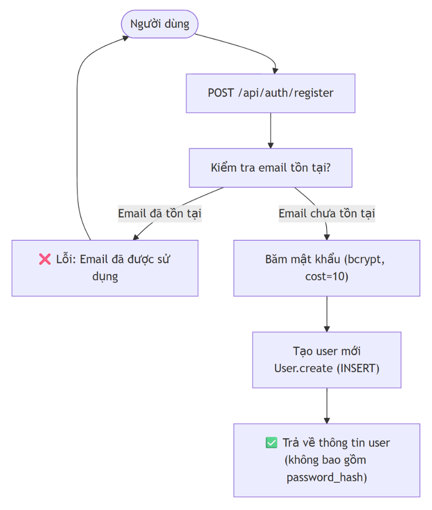
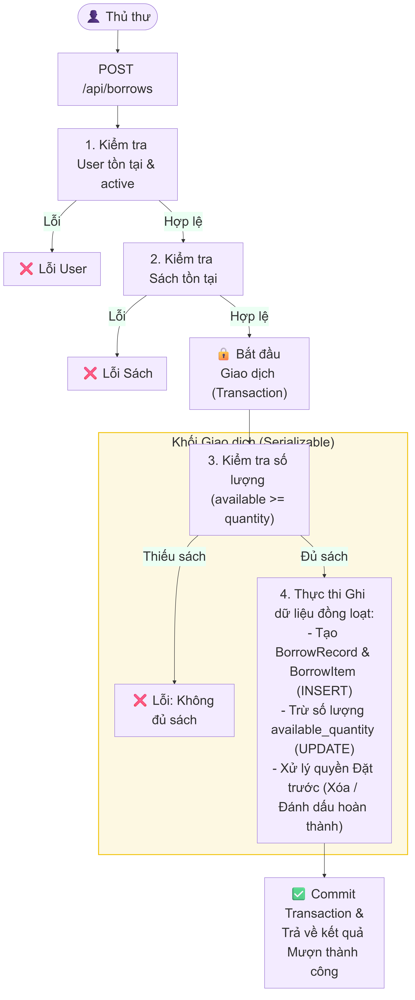
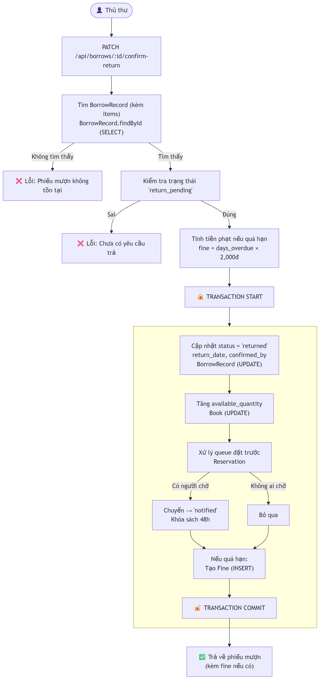
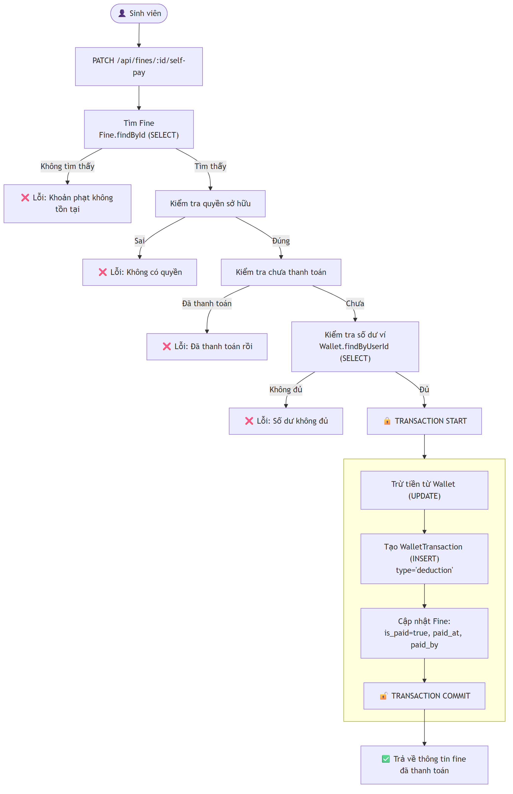
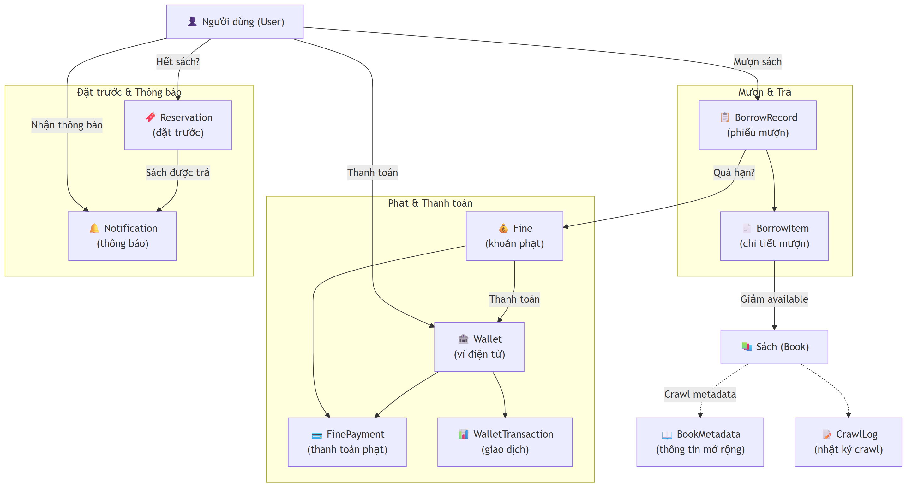
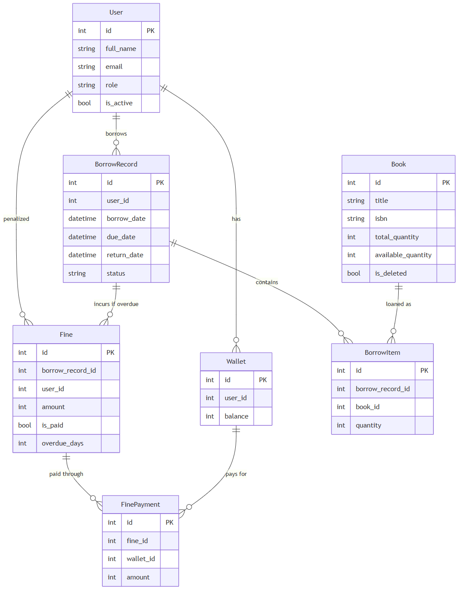
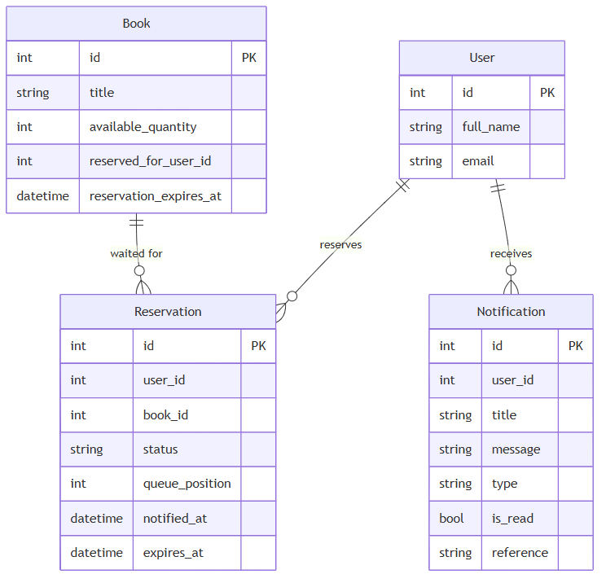
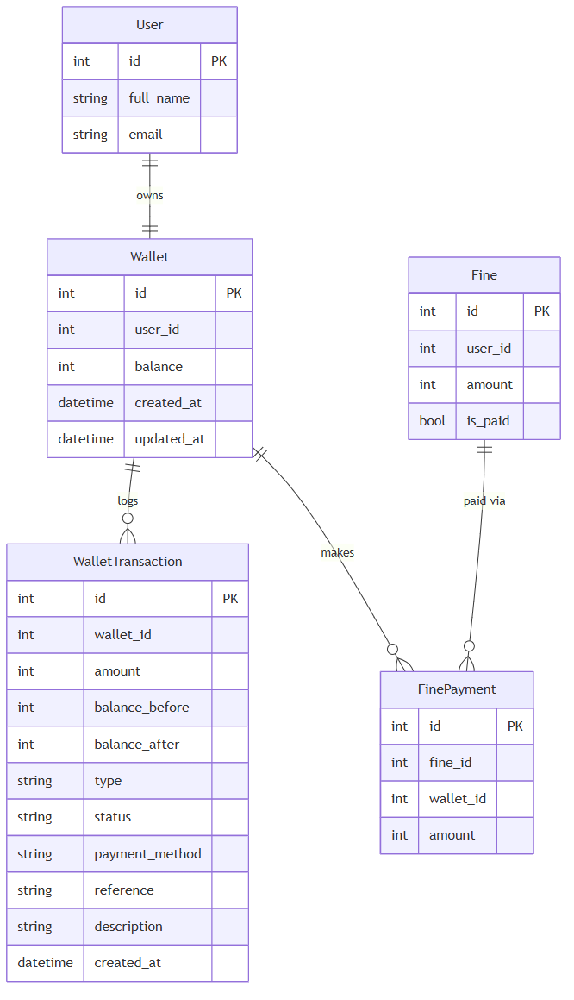
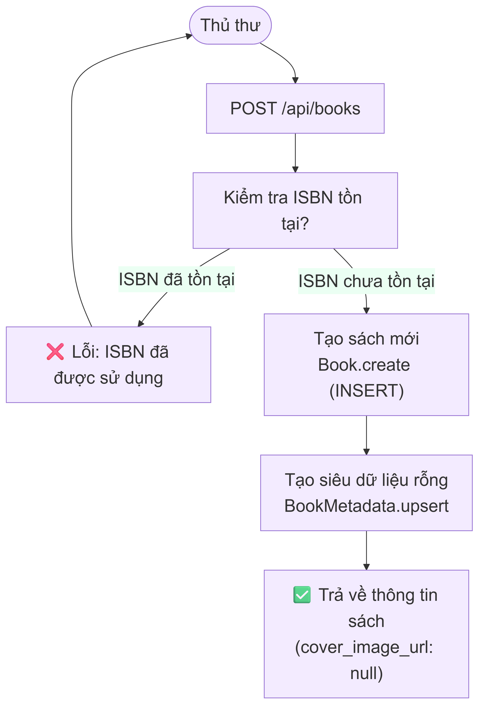
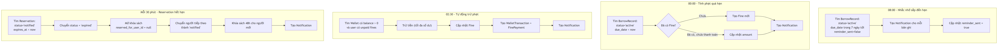

# BÁO CÁO THIẾT KẾ VÀ XÂY DỰNG HỆ THỐNG QUẢN LÝ THƯ VIỆN (LIBRARY LMS)

**Môn học:** SE104 — Nhập môn Công nghệ Phần mềm  
**Đơn vị:** Trường Đại học Công nghệ Thông tin (UIT)  

---

## MỤC LỤC
[Chương 1. Giới thiệu](#chương-1-giới-thiệu)
[Chương 2. Phân tích và Mô hình hóa Yêu cầu](#chương-2-phân-tích-và-mô-hình-hóa-yêu-cầu)
[Chương 3. Thiết kế Cơ sở Dữ liệu](#chương-3-thiết-kế-cơ-sở-dữ-liệu)
[Chương 4. Thiết kế Giao diện Người dùng](#chương-4-thiết-kế-giao-diện-người-dùng)
[Chương 5. Thiết kế Hệ thống](#chương-5-thiết-kế-hệ-thống)
[Chương 6. Triển khai và Kiểm thử](#chương-6-triển-khai-và-kiểm-thử)
[Chương 7. Đánh giá và Kết luận](#chương-7-đánh-giá-và-kết-luận)
[Chương 8. Hướng phát triển tương lai](#chương-8-hướng-phát-triển-tương-lai)
[Chương 9. Đóng góp của các thành viên](#chương-9-đóng-góp-của-các-thành-viên)

---

## Chương 1. Giới thiệu

### 1. Bối cảnh bài toán
Trong bối cảnh thời đại kỹ thuật số đang bùng nổ, việc chuyển đổi số tại các cơ quan giáo dục và thư viện đã trở thành một nhu cầu mang tính sống còn. Các thư viện truyền thống hiện nay phần lớn vẫn dựa vào hệ thống sổ sách thủ công hoặc các phần mềm quản trị lỗi thời, được thiết kế rời rạc. Điều này dẫn đến vô số những hạn chế trong công tác vận hành hàng ngày. Đầu tiên, quá trình tra cứu thông tin sách diễn ra cực kỳ chậm trễ; độc giả phải dùng thẻ giấy để ghi chú và đối chiếu, gây mất thời gian đáng kể. Thứ hai, đối với các thủ thư, việc kiểm soát số lượng sách đã được mượn, sách đang còn trong kho, và đặc biệt là danh sách những sinh viên mượn sách quá hạn, thường gặp rất nhiều sai sót do quá trình đối soát bằng mắt thường. 

Thêm vào đó, quy trình thu tiền phạt truyền thống hiện đang gây ra rất nhiều bất cập. Các khoản phạt nhỏ lẻ thường gây khó dễ cho thủ thư trong việc trả lại tiền thừa, đồng thời khó kiểm toán quỹ tiền mặt của thư viện vào cuối tháng. Hơn nữa, thư viện hiện tại cũng thiếu đi một bảng điều khiển trung tâm (Dashboard) cung cấp các báo cáo thống kê chính xác theo thời gian thực để hỗ trợ ban giám đốc đưa ra các quyết định nhập sách hoặc điều chỉnh quy chế mượn trả. 

Xuất phát từ thực tiễn trên, Hệ thống Quản lý Thư viện (LibraryLMS) được xây dựng nhằm giải quyết triệt để các vấn đề này. Hệ thống không chỉ nhắm tới việc số hóa toàn bộ quy trình nghiệp vụ của thư viện mà còn mong muốn mang lại một trải nghiệm người dùng hiện đại, lấy cảm hứng từ giao diện đột phá của ứng dụng nghe nhạc Spotify. Dự án được kỳ vọng sẽ không chỉ đóng vai trò là một phần mềm quản lý sổ sách đơn thuần, mà còn được tích hợp các tính năng tiên tiến nhất hiện nay như thanh toán không tiền mặt qua ví điện tử nội bộ, đặt trước sách qua hàng đợi ưu tiên, và tự động thu thập thông tin sách (metadata) thông qua việc kết nối với các kho dữ liệu thư viện lớn trên toàn cầu.

### 2. Kế hoạch khảo sát
Để xây dựng một hệ thống phần mềm đáp ứng sát nhất với nhu cầu thực tiễn, một kế hoạch khảo sát chi tiết đã được vạch ra và thực hiện một cách cẩn trọng. Kế hoạch khảo sát được xây dựng với mục tiêu trọng tâm là hiểu rõ quy trình mượn trả sách thực tế đang diễn ra hàng ngày, cũng như những nút thắt và khó khăn mà cả thủ thư lẫn độc giả đang gặp phải. 

Đối tượng tham gia khảo sát được lựa chọn một cách đa dạng, bao gồm các sinh viên từ nhiều năm học có nhu cầu mượn sách thường xuyên, và các cán bộ thư viện trực tiếp làm nhiệm vụ tại quầy lưu hành. Quá trình thu thập yêu cầu này được diễn ra xuyên suốt trong tuần đầu tiên của đồ án. Nhóm phát triển đã tiến hành phát phiếu khảo sát, phỏng vấn trực tiếp các thủ thư về những sai sót phổ biến nhất mà họ thường gặp, cũng như mong muốn của sinh viên khi tương tác với một hệ thống thư viện hiện đại. 

### 3. Phương pháp khảo sát
Phương pháp khảo sát được nhóm áp dụng kết hợp chặt chẽ giữa việc phân tích tài liệu lý thuyết và phân tích các phần mềm thực tiễn tương tự đang có trên thị trường. Đầu tiên, nhóm đã tiến hành nghiên cứu các quy chế mượn trả sách chuẩn hiện hành do Trường Đại học Công nghệ Thông tin ban hành, nhằm nắm vững các quy định về thời hạn mượn, định mức số lượng sách tối đa được mượn, và công thức tính tiền phạt trễ hạn.

Tiếp theo đó, nhóm tiến hành xem xét, dùng thử và đánh giá ưu nhược điểm của các hệ thống như OPAC (Online Public Access Catalog), và các hệ thống quản lý thư viện mã nguồn mở đang được sử dụng tại các trường đại học khác trên cả nước. Việc phân tích đối thủ này giúp nhóm nhận ra rằng, hầu hết các hệ thống hiện tại đều có giao diện người dùng quá cũ kỹ, màu sắc nhợt nhạt, gây nhàm chán cho người sử dụng và hoàn toàn không phù hợp với xu hướng ứng dụng web hiện đại (SPA - Single Page Application). 

### 4. Kết quả khảo sát
Từ quá trình khảo sát thực tế và phân tích đối thủ, nhóm đã đúc kết và rút ra được nhu cầu cấp thiết về việc xây dựng một hệ thống thư viện toàn diện, vượt ra khỏi giới hạn của một phần mềm nhập liệu thông thường. Hệ thống này không chỉ đơn thuần là nơi để thủ thư ghi nhận thao tác mượn và trả sách mà còn phải là một nền tảng phục vụ chủ động cho người dùng.

Cụ thể, hệ thống phải cho phép sinh viên tra cứu thông tin sách trực tuyến bất cứ lúc nào, cung cấp hình ảnh bìa sách và mô tả nội dung phong phú để kích thích văn hóa đọc. Quan trọng hơn, quy trình xử lý phạt quá hạn phải được tự động hóa hoàn toàn và thanh toán nhanh chóng bằng ví điện tử tích hợp, loại bỏ hoàn toàn các phiền toái liên quan đến tiền mặt. Đặc biệt, hệ thống cần hỗ trợ tính năng xếp hàng chờ thông minh (reservation). Khi một đầu sách yêu thích trong kho đã được mượn hết, sinh viên có thể đăng ký đặt trước. Khi sách được trả lại, hệ thống phải có khả năng tự động thông báo và giữ sách cho người dùng đứng đầu hàng chờ trong một khoảng thời gian quy định.

### 5. Cơ cấu tổ chức
Hệ thống được thiết kế để phục vụ hai nhóm người dùng chính biệt lập, mỗi nhóm có một giao diện và bộ quyền hạn riêng biệt nhằm đảm bảo an toàn thông tin và tính chuyên biệt hóa của nghiệp vụ. 

Nhóm thứ nhất là Thủ thư hoặc Quản trị viên (Librarian). Nhóm này được cấp quyền truy cập vào Bảng điều khiển quản trị (Admin Dashboard) với trách nhiệm giám sát toàn bộ hoạt động của thư viện. Họ có quyền quản lý danh mục sách (thêm, sửa, xóa mềm), quản lý tài khoản người dùng, kiểm duyệt các yêu cầu mượn và trả sách vật lý, cũng như theo dõi sát sao các báo cáo thống kê về sách quá hạn và tổng doanh thu tiền phạt.

Nhóm thứ hai là Độc giả (Reader/Student), đại diện cho phần đông lượng người dùng truy cập vào hệ thống. Họ sử dụng hệ thống thông qua một Bảng điều khiển cá nhân (Reader Dashboard) để tìm kiếm sách trong thư viện, theo dõi lịch sử mượn trả của chính mình, gửi các yêu cầu trả sách trực tuyến, nạp tiền vào ví điện tử cá nhân thông qua các phương thức thanh toán giả lập, và tiến hành thanh toán các khoản phạt ngay trên ứng dụng một cách tiện lợi.

### 6. Các chức năng nghiệp vụ
Dựa trên kết quả khảo sát và cơ cấu người dùng, các nghiệp vụ chính của hệ thống được xác định một cách rõ ràng. Hệ thống phải xử lý mượt mà quy trình đăng ký và xác thực thành viên mới, sử dụng chuẩn JWT để bảo mật. Kế đến là chức năng quản lý danh mục sách đồ sộ, được hỗ trợ đắc lực bởi một tiến trình chạy ngầm (Crawl Pipeline) có khả năng tự động thu thập thông tin siêu dữ liệu (metadata) từ các nguồn dữ liệu mở khổng lồ như Open Library và Google Books. 

Tiếp theo là các nghiệp vụ cốt lõi: xử lý quy trình mượn sách nghiêm ngặt với việc tự động giảm trừ số lượng tồn kho, xử lý quy trình trả sách và hoàn lại lượng tồn kho, tự động tính toán số ngày quá hạn và thu tiền phạt quá hạn từ ví điện tử. Cuối cùng, hệ thống phải tổng hợp tất cả các giao dịch này để cung cấp một cái nhìn toàn cảnh, thống kê toàn bộ dữ liệu dưới dạng các con số và biểu đồ phân tích trực quan.

---

## Chương 2. Phân tích và Mô hình hóa Yêu cầu

### 1. Giới thiệu chung
Chương này sẽ đi sâu vào việc đặc tả chi tiết nhất có thể các yêu cầu chức năng (Functional Requirements - FR) và phi chức năng của hệ thống. Những đặc tả này không chỉ dừng lại ở mặt lý thuyết mà được ánh xạ trực tiếp từ tài liệu kiến trúc, các tập tin thiết kế (DESIGN.md), và mã nguồn thực tế của dự án. Hệ thống nằm trong phạm vi là một ứng dụng web nguyên khối (monolithic) hiện đại. Phần giao diện người dùng (Frontend) được xây dựng hoàn toàn bằng thư viện React kết hợp với công cụ biên dịch siêu tốc Vite và bộ thư viện giao diện Tailwind CSS. Trong khi đó, phần máy chủ xử lý dữ liệu (Backend) sử dụng môi trường Node.js kết hợp cùng bộ khung Express.js, đảm bảo toàn bộ hệ thống giao tiếp với nhau qua chuẩn API RESTful.

### 2. Mô tả tổng quan
Người dùng sẽ tương tác với hệ thống thông qua một giao diện ứng dụng web một trang (React SPA). Việc sử dụng SPA giúp cho trải nghiệm chuyển trang trở nên mượt mà, không bị tải lại toàn bộ trang web, qua đó tối ưu hóa tốc độ và giảm băng thông. Giao diện này liên tục phát đi các yêu cầu REST API được cung cấp bởi backend Express. Backend sau đó sẽ làm nhiệm vụ bảo vệ các luồng dữ liệu, xác thực quyền truy cập trước khi tương tác với cơ sở dữ liệu quan hệ SQL Server thông qua công cụ Object-Relational Mapping (ORM) là Prisma.

Ngoài ra, backend cũng đảm nhiệm vai trò giao tiếp với các hệ thống ngoại vi (External APIs) thông qua phương thức HTTP GET tới Open Library và Google Books để làm giàu kho dữ liệu sách nội bộ. Hệ thống xoay quanh bảy yêu cầu cốt lõi bắt buộc do môn học quy định, nhưng nhóm phát triển đã tích hợp thêm các tính năng mở rộng có độ khó cao như hệ thống Ví điện tử hoàn chỉnh với lịch sử giao dịch rõ ràng, và chức năng Đặt trước ưu tiên (Reservation). Các ràng buộc thiết kế kỹ thuật (ADR) quy định rằng toàn bộ mã nguồn chỉ được sử dụng JavaScript thuần túy thay vì TypeScript để đồng nhất ngôn ngữ học thuật, sử dụng duy nhất hệ quản trị MS SQL Server để tương thích với giáo trình cơ sở dữ liệu của nhà trường, và tuân thủ nghiêm ngặt nguyên tắc Soft-Delete, nghĩa là dữ liệu sách không bao giờ bị xóa cứng khỏi ổ đĩa mà chỉ sử dụng cờ đánh dấu `is_deleted = true`.

### 3. Đặc tả yêu cầu hệ thống

**FR1. Đăng ký thẻ độc giả**

Về mặt thông tin chung, chức năng này được thiết kế để mở rộng tập người dùng của thư viện, cho phép bất kỳ ai cũng có thể tạo một tài khoản mới với vai trò mặc định là một độc giả (student/user). 

Trong sơ đồ dòng dữ liệu, luồng thông tin bắt đầu từ phía khách hàng (Client). Khách hàng sẽ điền thông tin cá nhân bao gồm tên hiển thị (Full Name), địa chỉ hòm thư điện tử (Email) và mật khẩu (Password) thông qua một biểu mẫu trên giao diện đăng ký. Luồng dữ liệu này được đóng gói thành một yêu cầu POST gửi đến điểm cuối `/api/auth/register`. Tại tiến trình xác thực và đăng ký nằm trên máy chủ, bộ kiểm duyệt sẽ tiến hành làm sạch dữ liệu và đối chiếu để đưa vào bảng User. Ngay sau khi bản ghi người dùng được thiết lập, một tiến trình phụ trợ khác sẽ được kích hoạt để tự động khởi tạo dữ liệu trong bảng Wallet (Ví điện tử), cấp cho độc giả một chiếc ví ảo ngay từ những giây đầu tiên gia nhập hệ thống.

Về các điều kiện tiên quyết (Pre-conditions), người dùng bắt buộc chưa có tài khoản trên hệ thống và địa chỉ email phải hợp lệ theo chuẩn định dạng quốc tế. Về hậu điều kiện (Post-conditions), một bản ghi người dùng với trạng thái `is_active = true` sẽ được tạo ra, một chiếc ví điện tử có số dư bằng không được liên kết với người dùng, và hệ thống sẽ sinh ra một chuỗi JWT để người dùng có thể lập tức đăng nhập.

Luồng sự kiện cơ bản được diễn ra chi tiết như sau: Người dùng truy cập đường dẫn `/register` và hoàn thành biểu mẫu. Sau khi bấm nút xác nhận, ứng dụng React gửi thông tin qua phương thức POST. Máy chủ nhận được yêu cầu sẽ thực thi một truy vấn trên Prisma để đếm số lượng người dùng có cùng email. Nếu kết quả đếm trả về không, hệ thống tiến hành băm mật khẩu bằng thuật toán mã hóa một chiều `bcrypt` với chi phí tính toán (cost factor) là 10 để bảo vệ an toàn tối đa. Sau đó, một giao dịch (Transaction) cơ sở dữ liệu được mở ra để chèn bản ghi vào bảng User với trường `role` được cố định là "user", và chèn tiếp một bản ghi vào bảng Wallet với `user_id` tương ứng. Giao dịch kết thúc, máy chủ sẽ tạo ra mã JWT và gửi phản hồi thành công về cho ứng dụng, đồng thời chuyển hướng người dùng đến trang Bảng điều khiển cá nhân.

Luồng sự kiện thay thế được kích hoạt khi có ngoại lệ xảy ra. Trong trường hợp email mà người dùng đăng ký đã tồn tại trong cơ sở dữ liệu, máy chủ sẽ lập tức hủy bỏ luồng xử lý và trả về mã lỗi HTTP 400 Bad Request kèm theo thông báo "Email đã được sử dụng". Giao diện người dùng sẽ hiển thị thông báo lỗi (Toast Notification) màu đỏ ở góc màn hình để yêu cầu người dùng thay đổi email.

**FR2. Tiếp nhận sách mới**

Chức năng tiếp nhận sách mới là một trong những nghiệp vụ thường xuyên nhất của thư viện. Nó cấp quyền cho thủ thư thêm các đầu sách mới nhập về vào hệ thống kho dữ liệu để chuẩn bị phục vụ bạn đọc.

Để minh họa cho quá trình này, theo sơ đồ luồng dữ liệu, thủ thư sẽ gửi thông tin cơ bản của sách, bao gồm Tiêu đề (Title), Tác giả (Author), Mã chuẩn quốc tế (ISBN), Thể loại (Category) và Tổng số lượng sách (Quantity). Dữ liệu này đi qua tiến trình Lưu Sách và cập nhật thẳng vào bảng cốt lõi là bảng Book. Điểm đột phá của hệ thống nằm ở chỗ, ngay sau khi lưu thành công, hệ thống backend sẽ phát đi một tín hiệu ngầm tới một tiến trình độc lập mang tên Crawl Metadata. Tiến trình này sử dụng giao thức HTTP GET để gọi ra bên ngoài Internet, truy vấn các API của thư viện Open Library và Google Books. Dữ liệu siêu hình ảnh và mô tả sau khi tải về sẽ được tiến trình này lưu trữ và cập nhật vào bảng vệ tinh BookMetadata.

Điều kiện tiên quyết của chức năng này là người thao tác phải có quyền truy cập cấp "librarian" và mã ISBN nhập vào phải là một mã chuẩn gồm 13 chữ số, không bị trùng lặp với bất kỳ cuốn sách nào đang có trong cơ sở dữ liệu. Hậu điều kiện của chức năng là tổng số lượng kho (total_quantity) và số lượng khả dụng (available_quantity) của đầu sách đó sẽ tăng lên đúng bằng số lượng vừa nhập, và quá trình làm giàu dữ liệu (enrichment) sẽ bắt đầu chạy nền để tải ảnh bìa.

Trong luồng sự kiện cơ bản, thủ thư bắt đầu bằng việc điền thông tin qua biểu mẫu trên giao diện `/books/new`. Khi nhấn lưu, yêu cầu được gửi lên bộ điều khiển `bookController`. Controller này gọi đến tầng dịch vụ `bookService`, tiến hành xác thực mã ISBN. Khi thông tin hợp lệ, Prisma sẽ ghi nhận dữ liệu vào bảng Book. Đáng chú ý là sau khi trả về kết quả thành công ngay lập tức cho thủ thư, máy chủ Node.js không dừng lại mà tiếp tục kích hoạt bất đồng bộ hàm `triggerCrawlPipeline`. Hàm này khởi động các crawler, đi lấy dữ liệu ảnh và tóm tắt, giúp cho cuốn sách vừa tạo ngay sau đó sẽ hiển thị đầy đủ bìa sách đẹp mắt trên giao diện tìm kiếm mà thủ thư không hề phải tốn công tìm kiếm và tải ảnh thủ công.

Đối với luồng sự kiện thay thế, nếu mã ISBN mà thủ thư nhập vào đã bị trùng với một đầu sách có sẵn (do sơ suất nhập liệu), tiến trình sẽ bị chặn lại ở khâu xác thực, Prisma sẽ báo lỗi vi phạm khóa duy nhất (Unique Constraint). Controller sẽ bắt lỗi này và thông báo rõ ràng cho thủ thư trên giao diện. Ngoài ra, nếu tiến trình Crawl Metadata gặp sự cố rớt mạng hoặc API bên ngoài từ chối phục vụ, nó sẽ tự động ghi lại lỗi vào bảng CrawlLog để quản trị viên có thể xem xét và chạy lại thủ công sau đó, hoàn toàn không làm gián đoạn quy trình nhập sách.

**FR3. Tra cứu sách**

Đây là chức năng quan trọng nhất nhắm tới trải nghiệm của độc giả, cho phép mọi đối tượng người dùng, dù đã đăng nhập hay chưa, đều có thể tìm kiếm, duyệt qua và lọc các tựa sách đang có sẵn trong kho lưu trữ của thư viện. 

Thông qua các sơ đồ dòng chảy dữ liệu, người dùng nhập vào các từ khóa liên quan đến tiêu đề hoặc tên tác giả, kết hợp với các bộ lọc theo thể loại (Category). Tiến trình tra cứu trên máy chủ sẽ tiếp nhận các tham số này, thực hiện các phép truy vấn gộp (JOIN) giữa bảng Book và bảng BookMetadata để trích xuất cả thông tin cơ bản lẫn hình ảnh minh họa, sau đó trả về một cấu trúc dữ liệu JSON chứa toàn bộ danh sách các sách khả dụng, thỏa mãn điều kiện lọc.

Tiền điều kiện cho chức năng này rất mở, người dùng chỉ cần kết nối internet. Hậu điều kiện là danh sách kết quả được tải về trình duyệt, kết hợp với các hiệu ứng hoạt hình (animations) mượt mà để hiển thị lên lưới giao diện (Grid Layout).

Luồng sự kiện cơ bản diễn ra rất nhanh. Người dùng gõ văn bản vào thanh tìm kiếm được thiết kế bo tròn dạng viên thuốc theo ngôn ngữ thiết kế Spotify. Ứng dụng frontend sử dụng cơ chế chống rung (debounce) để chờ người dùng gõ xong trước khi gửi yêu cầu `GET /api/books?search=keyword`. Máy chủ nhận yêu cầu, xây dựng cây truy vấn Prisma sử dụng toán tử LIKE để quét qua cả cột tiêu đề và tác giả. Do hệ thống đã áp dụng chiến lược đánh chỉ mục (Index) trên các cột này, tốc độ phản hồi gần như tức thời. Kết quả trả về chứa cả đường dẫn ảnh `cover_image_url` và thuộc tính `available_quantity` để giao diện có thể hiển thị biểu tượng "Còn hàng" hoặc "Hết sách" ngay trên bìa.

**FR4. Mượn sách**

Nghiệp vụ mượn sách là trung tâm của mọi hệ thống thư viện. Chức năng này được cấp riêng cho thủ thư để tạo ra các phiếu mượn mang tính ràng buộc pháp lý giữa thư viện và người sử dụng.

Theo sơ đồ luồng dữ liệu, quá trình này liên quan đến rất nhiều thực thể. Thủ thư cung cấp một ID của người mượn và một mảng chứa ID của các cuốn sách cần mượn. Tiến trình "Tạo Phiếu Mượn" tiếp nhận dữ liệu này, thực thi một khối lượng lớn công việc bao gồm việc lưu một bản ghi gốc vào bảng BorrowRecord và nhiều bản ghi chi tiết vào bảng BorrowItem. Nghiêm trọng nhất, tiến trình này phải đồng bộ cập nhật để giảm số lượng tồn kho `available_quantity` tại bảng Book, đảm bảo sách không thể bị mượn vượt quá số lượng vật lý trên kệ.

Điều kiện tiên quyết khắt khe được áp dụng: Người thao tác phải là thủ thư. ID người mượn phải là một tài khoản đang ở trạng thái hoạt động (`is_active = true`). Đặc biệt, số lượng đầu sách trong một phiếu mượn không được phép vượt quá 3 cuốn. Hơn thế nữa, mỗi cuốn sách yêu cầu phải có số lượng khả dụng lớn hơn 0 ở thời điểm tạo phiếu. Hậu điều kiện sau khi hoàn tất là một phiếu mượn mới ra đời với trạng thái là "active" (đang mượn), hệ thống kho được cập nhật tức thì.

Chi tiết về luồng sự kiện chính: Khi sinh viên mang sách tới quầy, thủ thư mở giao diện tạo phiếu mượn `/borrows/new`. Thủ thư chọn tên sinh viên từ một danh sách đổ xuống và quét (hoặc chọn) các sách. Giao diện frontend sẽ chặn ngay lập tức nếu chọn tới cuốn sách thứ tư. Sau khi gửi dữ liệu lên máy chủ, dịch vụ `borrowService` bắt đầu công việc. Đầu tiên, nó mở ra một Giao dịch cơ sở dữ liệu ở mức độ cô lập cực cao (Serializable) nhằm ngăn chặn hoàn toàn lỗi cập nhật đồng thời (race condition), đảm bảo không có hai thủ thư cùng mượn cuốn sách cuối cùng cùng một lúc. Hệ thống kiểm tra từng sách, nếu cuốn nào cũng thỏa mãn tồn kho, nó sẽ thực hiện chuỗi lệnh trừ kho và tạo phiếu. Phiếu mượn được gán thời hạn trả (due_date) theo quy định.

Trong luồng thay thế, nếu có bất kỳ một trong ba cuốn sách được chọn có `available_quantity` bằng 0 (có thể do thủ thư khác vừa tạo phiếu cách đó vài mili-giây), toàn bộ giao dịch Prisma sẽ bị hoàn tác (Rollback). Dữ liệu kho được bảo toàn nguyên vẹn, và hệ thống sẽ ném ra một thông báo lỗi ngoại lệ gửi thẳng về cho thủ thư: "Rất tiếc, cuốn sách X hiện không đủ số lượng tồn kho để hoàn tất giao dịch".

**FR5. Trả sách**

Chức năng trả sách đi đôi với mượn sách, giúp thư viện thu hồi tài sản và tái lưu thông sách, đồng thời là khâu chốt chặn để kích hoạt hệ thống phạt nếu có vi phạm.

Nhìn vào sơ đồ dữ liệu mô tả thao tác trả sách, thủ thư chỉ cần cung cấp mã định danh của phiếu mượn (Borrow Record ID) đang cần hoàn tất. Tiến trình "Xác nhận Trả" sẽ tiến hành truy xuất và thay đổi trạng thái của BorrowRecord từ 'active' hoặc 'return_pending' sang 'returned'. Ngay lập tức, một luồng xử lý khác sẽ bù đắp lại lượng tồn kho bằng cách tăng `available_quantity` trong bảng Book. Quan trọng hơn cả, hệ thống rẽ nhánh sang tiến trình "Tính phạt"; nếu số ngày kể từ ngày hạn trả đến ngày thực trả lớn hơn không, một khoản phạt sẽ được sinh ra và ghi đè vào bảng Fine.

Điều kiện tiên quyết ở đây là phiếu mượn phải tồn tại và chưa từng được xác nhận trả trước đó. Hậu điều kiện của chức năng là kho sách được khôi phục, tình trạng nợ nần của độc giả (nếu có) được xác lập rõ ràng và đặc biệt là hệ thống hàng đợi đặt trước (Reservation) được đánh thức.

Luồng sự kiện chính vô cùng phức tạp: Người dùng mang trả sách tại quầy, hoặc trước đó đã tự nhấn nút "Yêu cầu trả" trên điện thoại để báo trước cho thủ thư. Thủ thư tìm phiếu mượn đó và nhấn nút "Xác nhận". Máy chủ ghi nhận `return_date` là thời điểm hiện tại. Nó tiến hành vòng lặp để cộng dồn lại từng lượng `available_quantity` cho từng đầu sách nằm trong phiếu. Tiếp đó, hệ thống gọi hàm tiện ích `date.js` để tính khoảng cách tính theo ngày giữa `return_date` và `due_date`. Giả sử phiếu mượn bị trễ 5 ngày, thuật toán nội bộ sẽ nhân 5 ngày này với mức phí cấu hình cứng là 2,000 VNĐ để cho ra mức phạt 10,000 VNĐ. Khoản phạt này được ghi vào bảng Fine, gắn chặt với ID của độc giả. Đặc biệt, sau khi kho sách vừa tăng lên, một trình kích hoạt (trigger) ngầm sẽ quét qua bảng Reservation. Nó sẽ phát hiện ra liệu có độc giả nào đang xếp hàng chờ để mượn những cuốn sách vừa được trả hay không. Nếu có, sách sẽ bị đánh dấu khóa tạm thời trong 48 giờ (`reserved_for_user_id`) và một thông báo sẽ tự động bắn vào hòm thư nội bộ của độc giả đang xếp hàng.

**FR6. Thu tiền phạt**

Để đơn giản hóa công tác kế toán và giảm tải lượng tiền mặt giao dịch tại thư viện, chức năng Thu tiền phạt được số hóa hoàn toàn thông qua sự kết hợp với hệ thống Ví điện tử (Wallet). 

Theo sơ đồ luồng thanh toán, đây là chức năng tự phục vụ dành cho độc giả. Độc giả phát lệnh yêu cầu thanh toán một khoản phạt cụ thể. Tiến trình "Trừ tiền Ví" sẽ can thiệp vào bảng Wallet của chính người dùng đó để cấu trừ số dư, đồng thời cập nhật trạng thái đã thanh toán tại bảng Fine. Mọi thao tác này đều để lại vết (audit ledger) thông qua các bản ghi không thể xóa nhòa trong bảng WalletTransaction và FinePayment.

Tiền điều kiện bắt buộc là độc giả phải có số dư khả dụng trong ví lớn hơn hoặc bằng mức phí phạt đang muốn thanh toán, và khoản phạt đó chưa được đóng trước đó. Hậu điều kiện là số dư ví giảm xuống chính xác bằng số tiền đóng, khoản phạt chuyển trạng thái `is_paid = true`.

Diễn biến luồng sự kiện cơ bản cho thấy một trải nghiệm người dùng cực kỳ trơn tru. Tại giao diện quản lý nợ, độc giả thấy một nút "Thanh toán ngay". Nhấn vào đó, yêu cầu POST được chuyển tới điểm cuối `/api/wallet/pay-fine` kèm theo ID của khoản phạt. Dịch vụ ví điện tử `walletService` lập tức lấy thông tin số dư hiện tại từ cơ sở dữ liệu. Nó so sánh và thấy số dư hoàn toàn đủ khả năng chi trả. Lại một lần nữa, Giao dịch cơ sở dữ liệu (Transaction) được áp dụng. Hệ thống tiến hành trừ tiền từ ví, cập nhật số dư mới nhất. Ghi một bản ghi vào WalletTransaction đánh dấu loại giao dịch là `fine_payment` (âm tiền), ghi một bản ghi vào FinePayment để lưu lịch sử đóng phạt chi tiết, và cập nhật cờ `is_paid` của bảng Fine. Kết quả được phản hồi về màn hình của độc giả, hiển thị trạng thái ăn mừng với pháo hoa trên màn hình (thông qua Toast message).

Trong một luồng thay thế phổ biến, nếu tài khoản của sinh viên chỉ còn 5,000 VNĐ trong khi khoản phạt lên tới 10,000 VNĐ, khi nhấn nút, bộ lọc logic backend sẽ chặn giao dịch lại, không để số dư bị rơi vào trạng thái âm tiền. Phản hồi lỗi 400 "Insufficient balance" sẽ bật lên và giao diện người dùng sẽ khéo léo hiển thị một nút kêu gọi hành động (Call to action) điều hướng sinh viên sang trang Nạp tiền vào ví.

**FR7. Lập báo cáo**

Một hệ thống quản trị hiện đại không thể thiếu khả năng tổng hợp dữ liệu, chức năng Lập báo cáo đóng vai trò như bộ não phân tích cung cấp thông số thống kê theo thời gian thực (Real-time Analytics Dashboard) cho ban quản lý.

Thông qua biểu đồ phân tích dữ liệu, tiến trình thống kê nhận yêu cầu xem Dashboard từ thủ thư. Nó hoạt động như một cỗ máy tổng hợp, truy vấn hàng loạt các bảng dữ liệu gốc như Book, User, BorrowRecord, và Fine. Các dữ liệu thô này được nhào nặn qua các phép toán tổng hợp (COUNT, SUM, GROUP BY) để tạo ra một cấu trúc kết quả đa chiều.

Điệu kiện tiên quyết là thủ thư phải truy cập trang `/dashboard` và có quyền hạn truy cập cấp cao. 

Luồng sự kiện cơ bản vô cùng mạnh mẽ: Khi trang bảng điều khiển được tải trên trình duyệt, hàng loạt các API yêu cầu lấy dữ liệu thống kê được phát đi. Tại backend, bộ điều khiển Dashboard thực thi các câu lệnh đếm tổng số đầu sách đang có trong kho, đếm tổng số người dùng có vai trò là độc giả, đếm tổng số phiếu mượn đang trong trạng thái kích hoạt, tính tổng số dư nợ chưa thu được từ các khoản phạt. Đồng thời, nó lấy ra một danh sách giới hạn các phiếu mượn đang bị trễ hạn trầm trọng nhất để cảnh báo thủ thư. Tất cả các dữ liệu khổng lồ này được đóng gói trong một cấu trúc JSON duy nhất và gửi về frontend. Tại đây, React sẽ phân giải chúng thành các thẻ số liệu lớn nổi bật trên nền xám đen của phong cách thiết kế Spotify, giúp thủ thư có thể nắm bắt bức tranh toàn cảnh của thư viện chỉ trong một cái chớp mắt. Lợi ích của thiết kế này là báo cáo luôn luôn phản ánh số liệu hiện tại mà không cần phải chờ đợi quá trình chốt sổ thủ công vào cuối ngày.

## Chương 3. Thiết kế Cơ sở Dữ liệu

### I. Quá trình thiết kế CSDL
Hệ thống lưu trữ và quản trị cơ sở dữ liệu đóng vai trò là xương sống của toàn bộ kiến trúc phần mềm LibraryLMS. Việc thiết kế cơ sở dữ liệu không chỉ dừng lại ở việc tạo ra các bảng lưu trữ thông tin đơn thuần, mà còn phải phản ánh chính xác các luồng nghiệp vụ phức tạp đã được phân tích ở chương trước. Quá trình thiết kế được tiến hành một cách bài bản, bắt đầu từ việc nắm bắt các yêu cầu từ phía người dùng (yêu cầu quản lý sách, thẻ độc giả, phiếu mượn, ví điện tử), xây dựng mô hình thực thể mối kết hợp (Entity-Relationship Model), và cuối cùng là ánh xạ sang mô hình cơ sở dữ liệu quan hệ vật lý.

Hệ thống quyết định sử dụng Microsoft SQL Server làm nền tảng lưu trữ chính thức. Lựa chọn này xuất phát từ khả năng hỗ trợ giao dịch (transaction) mạnh mẽ với các cấp độ cô lập (isolation levels) cực cao, một yếu tố sống còn khi hệ thống phải xử lý các thao tác trừ tồn kho mượn sách. Để tương tác với cơ sở dữ liệu, nhóm phát triển sử dụng công cụ Prisma ORM. Prisma mang lại một cú pháp khai báo mô hình (`schema.prisma`) cực kỳ trực quan, cho phép nhóm tự động tạo ra các đoạn mã truy vấn an toàn về mặt kiểu dữ liệu (type-safe) mà không cần phải viết các câu lệnh SQL thô phức tạp. 

Trong thiết kế này, phần lớn các bảng dữ liệu được tuân thủ nghiêm ngặt theo chuẩn hóa dạng 3 (Third Normal Form - 3NF) nhằm mục đích loại bỏ hoàn toàn việc dư thừa thông tin, tránh được các dị thường khi thêm, sửa hoặc xóa dữ liệu. Tuy nhiên, nhóm thiết kế cũng linh hoạt áp dụng kỹ thuật phi chuẩn hóa (denormalization) một cách có chủ đích ở một vài bảng trọng yếu. Điển hình nhất là bảng lưu trữ các khoản phạt (Fine). Thay vì chỉ lưu mã phiếu mượn (borrow_record_id) và yêu cầu hệ thống phải thực hiện phép nối bảng (JOIN) khổng lồ mỗi khi muốn tính tổng nợ của một độc giả cụ thể, nhóm quyết định lưu trực tiếp mã người dùng (user_id) vào bảng Fine. Việc dư thừa dữ liệu có kiểm soát này giúp tăng tốc đáng kể tốc độ truy xuất dữ liệu trên bảng điều khiển quản trị, nơi mà thời gian phản hồi hệ thống (latency) được ưu tiên hàng đầu.

### II. Mô hình logic hoàn chỉnh

Mô hình logic của hệ thống được cấu trúc thông qua mười hai bảng thực thể chính, được phân chia thành các nhóm logic có liên kết chặt chẽ với nhau để tạo thành một khối dữ liệu thống nhất, không rạn nứt.

Nhóm đầu tiên là nhóm quản trị tài khoản và tài chính, bao gồm bảng Người dùng (User) và bảng Ví điện tử (Wallet). Mối quan hệ giữa chúng là một-một (1:1), nghĩa là mỗi tài khoản chỉ được phép sở hữu một và chỉ một chiếc ví ảo trong suốt vòng đời trên hệ thống. Đồng thời, bảng Người dùng đóng vai trò là bảng cha của rất nhiều bảng khác. Nó thiết lập quan hệ một-nhiều (1:N) với bảng Phiếu mượn (BorrowRecord) vì một sinh viên có quyền mượn sách nhiều lần, quan hệ một-nhiều với bảng Tiền phạt (Fine) do một người có thể bị phạt nhiều lần, và cả bảng Thông báo (Notification).

Nhóm thứ hai là nhóm danh mục cốt lõi, bao gồm bảng Sách (Book) và bảng Thông tin mở rộng (BookMetadata). Tương tự như ví điện tử, đây là mối quan hệ một-một (1:1). Cách thiết kế chia cắt bảng này (vertical partitioning) giúp bảng Book duy trì kích thước vật lý vô cùng nhỏ gọn, chứa các dữ liệu số học thuần túy phục vụ cho việc đếm tồn kho, trong khi đó bảng BookMetadata sẽ đóng vai trò như một kho chứa (BLOB) cho các đoạn văn bản mô tả dài và các đường dẫn hình ảnh nặng nề thu thập từ API bên ngoài.

Nhóm thứ ba là trái tim của hệ thống: nhóm Giao dịch. Bảng Phiếu mượn (BorrowRecord) là bảng chứa thông tin tổng quát của một giao dịch mượn (header). Nó sẽ có quan hệ một-nhiều (1:N) với bảng Chi tiết mượn (BorrowItem) theo mô hình Master-Detail kinh điển. Bảng BorrowItem sẽ đóng vai trò là bảng trung gian để hóa giải mối quan hệ nhiều-nhiều giữa Phiếu mượn và Sách. Mỗi khi quá hạn trả, hệ thống sẽ sinh ra một khoản phạt. Do đó, một Phiếu mượn có thể có nhiều Tiền phạt, tạo thành mối quan hệ một-nhiều (1:N) giữa BorrowRecord và Fine. 

Cuối cùng là nhóm bổ trợ bao gồm các tính năng nâng cao. Bảng Đặt trước (Reservation) là cầu nối trung gian giữa Người dùng và Sách, hình thành nên một hàng đợi ưu tiên. Bảng Giao dịch ví (WalletTransaction) và bảng Thanh toán phạt (FinePayment) liên kết chặt chẽ với bảng Wallet để tạo nên một hệ thống sổ cái kiểm toán (audit ledger) minh bạch và không thể xóa bỏ.

### III. Từ điển dữ liệu

Từ điển dữ liệu (Data Dictionary) cung cấp cái nhìn chi tiết nhất về các thuộc tính và kiểu dữ liệu vật lý được lưu trữ trong máy chủ SQL Server. Toàn bộ cấu trúc này được trích xuất trực tiếp và phản ánh chính xác cấu trúc khai báo từ tập tin mã nguồn `schema.prisma`.

**1. Khối Tài khoản và Tài chính**

Bảng **User** là bảng trọng tâm. Khóa chính là cột `id` kiểu số nguyên (INT) được thiết lập tự động tăng (Auto-increment). Thông tin cá nhân gồm có `full_name` lưu tên đầy đủ và `email` lưu hòm thư định danh, trong đó cột email được cấu hình chỉ mục duy nhất (UNIQUE) trên cơ sở dữ liệu. Cột `password_hash` làm nhiệm vụ lưu trữ chuỗi băm của mật khẩu gốc. Cột `role` phân loại tài khoản bằng chuỗi văn bản với giá trị mặc định là "user" dành cho độc giả. Cột `is_active` sử dụng kiểu logic Boolean (true/false) nhằm hỗ trợ tính năng khóa tài khoản tạm thời thay vì phải xóa hoàn toàn người dùng khỏi hệ thống.

Bảng **Wallet** (Ví điện tử) gắn bó mật thiết với người dùng. Khóa chính là `id`. Nó tham chiếu tới chủ sở hữu thông qua khóa ngoại `user_id`, cột này cũng được đặt ràng buộc UNIQUE để duy trì tính chất một-một. Cột quan trọng nhất là `balance` kiểu số nguyên INT để lưu trữ số dư theo đơn vị tiền tệ VNĐ, mặc định khởi tạo ở mức 0. Bảng **WalletTransaction** đóng vai trò ghi nhận mọi biến động số dư. Cột `wallet_id` trỏ về ví, cột `amount` lưu số tiền thay đổi (số dương hoặc âm), cột `type` phân loại thao tác là 'topup' (nạp tiền) hay 'deduction' (trừ tiền), và cột `status` theo dõi trạng thái giao dịch. 

**2. Khối Danh mục và Siêu dữ liệu**

Bảng **Book** lưu trữ thông tin định danh của một cuốn sách. Khóa chính là `id`. Các trường văn bản bao gồm `title` (Tiêu đề), `author` (Tác giả), và `category` (Thể loại). Đặc biệt, cột `isbn` dùng để lưu trữ Mã số tiêu chuẩn quốc tế cho sách, được gán cờ UNIQUE để ngăn chặn việc nhập trùng lặp đầu sách. Đối với việc quản lý kho, bảng sử dụng hai cột số nguyên: `total_quantity` phản ánh tổng số bản sao vật lý mà thư viện đang sở hữu, và `available_quantity` phản ánh số lượng bản sao hiện đang nằm trên kệ và sẵn sàng để cho mượn. Cuối cùng, cờ `is_deleted` kiểu Boolean được sử dụng cho kỹ thuật xóa mềm.

Bảng **BookMetadata** là một bảng mở rộng của sách với khóa ngoại `book_id` gán cờ UNIQUE. Bảng này tập trung vào các trường dữ liệu phong phú nhưng có dung lượng lớn. Cột `cover_image_url` lưu trữ đường dẫn mạng chứa tệp tin ảnh bìa sách. Cột `description` lưu đoạn văn bản tóm tắt nội dung sách sử dụng định dạng chuỗi ký tự dài NTEXT của SQL Server. Ngoài ra còn có các cột như `publisher` (Nhà xuất bản) và `publish_year` (Năm xuất bản).

**3. Khối Nghiệp vụ Cốt lõi**

Bảng **BorrowRecord** lưu trữ gốc của một giao dịch mượn sách. Cột khóa ngoại `user_id` liên kết đến sinh viên đang mượn. Bảng sử dụng 3 cột mốc thời gian (DateTime) vô cùng quan trọng: `borrow_date` lưu thời điểm xuất sách rời khỏi quầy, `due_date` ấn định ngày hạn cuối cùng để mang sách trả lại, và `return_date` được để trống (NULL) ban đầu và chỉ được cập nhật khi thủ thư thực sự nhận lại sách. Cột `status` quản lý chu kỳ sống của phiếu mượn qua các trạng thái như "active" (đang mượn) hoặc "returned" (đã trả). 

Bảng **BorrowItem** là bản ghi chi tiết các hạng mục bên trong một phiếu mượn. Bảng chứa hai khóa ngoại là `borrow_record_id` trỏ về phiếu mượn cha, và `book_id` trỏ về cuốn sách cụ thể đang được mượn. Cột `quantity` lưu số lượng bản sao của chính cuốn sách đó đang được mang đi trong giao dịch này.

**4. Khối Chế tài và Xử lý vi phạm**

Bảng **Fine** (Tiền phạt) làm nhiệm vụ thiết lập chế tài. Khóa chính là `id`. Bảng liên kết đến cả phiếu mượn vi phạm qua `borrow_record_id` và trực tiếp đến độc giả qua `user_id`. Cột `amount` lưu tổng số tiền phạt dựa trên đơn giá mặc định cấu hình trong mã nguồn. Cột `reason` lưu lý do phạt (thông thường là do trả quá hạn). Cột `is_paid` kiểu Boolean đóng vai trò kiểm soát việc nợ xấu. Bảng **FinePayment** là sự phản chiếu lịch sử khi độc giả thanh toán nợ. Nó lưu lại `fine_id` (khoản nợ nào), `wallet_id` (lấy từ ví nào) và `amount` (số tiền đã trích xuất là bao nhiêu).

---

## Chương 4. Thiết kế Giao diện Người dùng

### 1. Sơ đồ điều hướng màn hình
Để mang lại trải nghiệm không gián đoạn tương tự như các ứng dụng di động hiện đại, toàn bộ kiến trúc điều hướng màn hình của hệ thống được xây dựng trên thư viện React Router trong tập tin cốt lõi `App.jsx`. Hệ thống điều hướng này không chỉ đơn thuần chuyển đổi các thành phần giao diện (Component) mà còn tích hợp chặt chẽ cơ chế bảo vệ tuyến đường (Route Guards) dựa trên vai trò (Role) từ ngữ cảnh xác thực trung tâm (Auth Context).

Người dùng khi mới bước vào hệ thống sẽ bắt đầu tại cụm trang công khai, bao gồm một trang giới thiệu chào mừng (Landing Page) kết hợp với màn hình Đăng nhập (`/login`) và Đăng ký (`/register`). Tại đây, sau khi tiến trình xác thực thành công, hệ thống điều hướng sẽ hoạt động giống như một bộ phân luồng giao thông thông minh. Nếu mã thông báo JWT xác định người dùng có vai trò là "librarian", hệ thống sẽ dẫn họ tiến thẳng vào khu vực quản trị với điểm đến đầu tiên là màn hình Bảng điều khiển (`/dashboard`). Ngược lại, nếu người dùng là một độc giả thông thường, họ sẽ được chào đón tại không gian cá nhân với Bảng điều khiển riêng (`/my-dashboard`).

Từ các điểm xuất phát này, người dùng có thể thoải mái di chuyển sang các phân hệ chức năng tương ứng mà không cần phải chờ trình duyệt tải lại trang. Cụm tuyến đường về quản lý sách bao gồm màn hình danh sách (`/books`), màn hình tạo mới (`/books/new`) và màn hình chỉnh sửa chi tiết (`/books/:id/edit`). Cụm tuyến đường quản lý quá trình mượn trả chứa đựng màn hình danh sách tổng hợp (`/borrows`), màn hình tạo phiếu xuất mượn (`/borrows/new`) và màn hình xử lý xác nhận trả (`/borrows/:id/return`). Dành riêng cho khu vực tài chính, độc giả có thể truy cập tuyến đường ví điện tử (`/wallet`) để nạp tiền và thanh toán, trong khi quản trị viên truy cập màn hình tiền phạt (`/fines`) để rà soát danh sách nợ xấu. Không thể thiếu các tuyến đường dành riêng cho việc cấu hình hệ thống như quản lý danh sách người dùng (`/users`) và một màn hình theo dõi lịch sử hệ thống (Log Viewer) đối với tiến trình thu thập dữ liệu ngầm (`/logs`).

### 2. Danh sách màn hình & Đặc tả UI

Triết lý thiết kế giao diện của LibraryLMS được lấy cảm hứng trực tiếp từ bản sắc thiết kế của siêu ứng dụng nghe nhạc Spotify. Dự án đã mạnh dạn rũ bỏ hình ảnh cũ kỹ, khô khan của các phần mềm quản lý hành chính thông thường để khoác lên mình một phong cách Dark Theme cực kỳ hiện đại, đắm chìm và lôi cuốn.

Đặc trưng đầu tiên của ngôn ngữ thiết kế này là việc sử dụng tông màu nền đen sâu thẳm (`#121212`) làm chủ đạo, bao phủ toàn bộ các khu vực không gian tĩnh. Nền đen sâu này không chỉ giúp giảm thiểu căng thẳng cho mắt khi phải làm việc nhiều giờ liền mà còn đóng vai trò như một bức phông bạt tối, làm tôn lên sức sống rực rỡ của các ảnh bìa sách. Để tạo điểm nhấn thị giác và kêu gọi hành động, sắc xanh Spotify Green huyền thoại (`#1ed760`) được sử dụng một cách có chọn lọc. Màu xanh này chỉ xuất hiện trên các nút bấm mang tính chức năng chính yếu (Call to action) hoặc để làm nổi bật số dư ví, tuyệt đối không lạm dụng vào việc trang trí.

Đặc trưng thứ hai là hình học bo tròn. Gần như tất cả các yếu tố tương tác từ nút bấm, thanh tìm kiếm cho đến các nhãn trạng thái đều được bo tròn mạnh ở hai đầu, tạo thành hình dáng của những viên thuốc (Pill Shape). Thiết kế này tạo cảm giác thân thiện, mềm mại và đặc biệt tối ưu cho những thao tác chạm trên màn hình di động.

**Màn hình Đăng nhập (/login)**

Màn hình đăng nhập được thiết kế theo lối tối giản hóa tối đa sự xao nhãng. Một nền xám đen bao phủ toàn bộ khung nhìn, với biểu mẫu đăng nhập nằm tĩnh lặng ngay tại trung tâm màn hình. Biểu mẫu được bao bọc bởi một đường viền rất mỏng và hiệu ứng đổ bóng mờ (box-shadow) để nó dường như đang trôi nổi trên không gian tối. Bên trong biểu mẫu, các trường nhập liệu Email và Password có màu nền xám nhạt (`#1f1f1f`) khi tĩnh và nổi bật viền xanh khi được người dùng nhấn chọn (focus). Nút "Đăng nhập" là ngôi sao của màn hình này, nó là một viên thuốc màu xanh lá cây rực sáng nằm chiếm trọn chiều ngang, cùng kiểu chữ hoa (Uppercase) dày đặc và khoảng cách các chữ cái (Letter-spacing) rộng rãi, mang lại một cảm giác rất công nghệ và dứt khoát.

**Màn hình Bảng điều khiển (Dashboard)**

Màn hình Bảng điều khiển là nơi hiển thị toàn cảnh sức khỏe của thư viện. Giao diện được chia thành hai cột theo tỷ lệ chuẩn. Cột bên trái là thanh điều hướng (Sidebar) tĩnh, cố định và có màu nền đen sâu thẳm nhất. Cột bên phải, rộng rãi hơn, là không gian hiển thị thông tin chính. Phần trên cùng của không gian này là một tập hợp các thẻ thông tin (Statistic Cards). Các thẻ này sử dụng nền xám tối (`#181818`), nổi bật lên so với nền trang. Chúng chứa các con số tổng quan bằng phông chữ cực lớn như: Tổng số sách, Số người dùng kích hoạt, hay Số tiền phạt cần thu hồi. Các con số này được nhấn nhá bằng những biểu tượng nhỏ mang tính chỉ báo. Trải dài ở phần dưới của giao diện là một bảng dữ liệu danh sách các phiếu mượn đang gặp tình trạng quá hạn trầm trọng. Bảng dữ liệu này không sử dụng các đường kẻ bảng màu đen nhàm chán mà sử dụng những đường chỉ màu xám nhạt đứt đoạn làm phân cách giữa các hàng, mỗi khi người dùng di chuột ngang qua một hàng, hàng đó sẽ sáng bừng lên một chút nhờ hiệu ứng hover.

**Màn hình Quản lý Sách (/books)**

Đây là không gian dành cho sự khám phá. Màn hình quản lý sách cho phép hiển thị dữ liệu một cách vô cùng linh hoạt, người dùng có thể chuyển đổi giữa việc xem ở dạng bảng (Table view) cứng nhắc hoặc dạng lưới (Grid view) trực quan bằng một nút bấm trên góc phải. Ở chế độ xem lưới, màn hình trông hệt như một kho nhạc khổng lồ. Các bìa sách đầy màu sắc được kéo về từ internet xếp thành những ô vuông đều đặn trên nền xám tối. Không gian giữa các sách (gap) được thiết kế khá chật để duy trì mật độ thông tin cao. Điểm thú vị là mỗi thẻ sách đều được trang bị hiệu ứng chuyển động mượt mà bằng thư viện Framer Motion. Khi người dùng đưa con trỏ chuột lướt qua một cuốn sách, chiếc thẻ đó sẽ nhẹ nhàng nhô lên cao, kèm theo đó là một hiệu ứng bóng đổ lan tỏa ra xung quanh, tạo ra ảo giác về không gian ba chiều vô cùng sinh động. Cụm thanh tìm kiếm ở phía trên cùng là một trường nhập liệu bo góc viên thuốc dài, chiếm sự chú ý, nơi người dùng có thể gõ bất cứ thông tin nào để lọc kết quả ngay tức thời.

**Luồng Xử lý Thêm Sách Mới (Add Book Flow)**

Khi thủ thư thêm sách mới, hệ thống sẽ thực hiện giao dịch (transaction) lưu thông tin văn bản và mã ISBN vào cơ sở dữ liệu. Ảnh bìa tạm thời được để trống để trình duyệt tự động tải ngầm (on-demand) từ Open Library sau này.

**Màn hình Mượn sách (/borrows/new)**
Màn hình phục vụ nghiệp vụ tạo phiếu mượn này được thiết kế để đảm bảo sự chính xác tuyệt đối. Nó bao gồm hai khu vực làm việc song song. Bên trái là một biểu mẫu tĩnh yêu cầu thủ thư chọn thông tin của sinh viên từ một danh sách thả xuống. Bên phải là một thanh tìm kiếm sách thông minh. Mỗi khi thủ thư tìm và nhấp chọn một cuốn sách, cuốn sách đó sẽ bay vào "giỏ hàng mượn" nằm ở góc dưới màn hình. Giao diện này đặc biệt thông minh ở chỗ nó sẽ hiển thị một thanh tiến trình (Progress bar) cho biết thủ thư đã mượn bao nhiêu cuốn trên tổng giới hạn 3 cuốn. Nếu số lượng sách đạt mức tối đa, toàn bộ khu vực tìm kiếm sẽ bị vô hiệu hóa (disabled) và đổi sang màu xám, trực quan hóa rõ ràng quy định của hệ thống mà không cần người dùng phải đọc thông báo chữ.

**Màn hình Ví Điện Tử (/wallet)**
Màn hình cuối cùng là trung tâm tài chính của độc giả. Thiết kế khu vực này mang đậm phong cách ví tiền kỹ thuật số. Đập vào mắt người dùng ngay từ cái nhìn đầu tiên là một tấm thẻ hiển thị khổng lồ, nằm chễm chệ chiếm trọn nửa trên màn hình. Tấm thẻ này ghi rõ dòng chữ "Số dư hiện tại" đi kèm với con số hiển thị hàng chục ngàn VNĐ bằng màu xanh lá đặc trưng để biểu thị sự thịnh vượng. Ngay bên dưới tấm thẻ quyền lực này là một nút "Nạp tiền" cũng được tạo hình viên thuốc kích thước lớn. Nửa dưới của màn hình là không gian dành cho sự minh bạch tài chính. Nó chứa một bảng liệt kê chi tiết danh sách lịch sử giao dịch. Các giao dịch nạp tiền sẽ mang dấu cộng với màu xanh, trong khi các giao dịch thanh toán phạt sẽ mang dấu trừ với sắc đỏ báo động. Sự tương phản màu sắc này giúp người dùng dễ dàng theo dõi dòng chảy tài chính của bản thân chỉ bằng một cái lướt mắt nhanh chóng.

## Chương 5. Thiết kế Hệ thống

### 1. Kiến trúc hệ thống
Hệ thống LibraryLMS được xây dựng trên một nền tảng vững chắc tuân theo kiến trúc nguyên khối ba tầng (Three-tier Monolithic Architecture). Lựa chọn kiến trúc nguyên khối thay vì vi dịch vụ (microservices) là một quyết định mang tính chiến lược, hoàn toàn phù hợp với quy mô của một hệ thống quản lý thư viện cấp trường học. Nó giúp giảm thiểu độ phức tạp trong khâu triển khai, đồng thời tăng cường sự chặt chẽ và nhất quán của dữ liệu mà không cần phải lo lắng về các giao dịch phân tán (distributed transactions) đầy rủi ro.

Cấu trúc ba tầng của hệ thống được phân tách một cách vô cùng rõ nét và khoa học:

**Tầng thứ nhất - Tầng Trình diễn (Presentation Layer):**
Đây là phần mà người dùng tương tác trực tiếp, được đại diện bởi một ứng dụng giao diện đơn trang (Single Page Application - SPA). Tầng này được xây dựng hoàn toàn bằng thư viện React mạnh mẽ, kết hợp với công cụ đóng gói và khởi tạo dự án siêu tốc Vite. Tầng trình diễn chịu trách nhiệm kiểm soát giao diện hiển thị, quản lý trạng thái dữ liệu cục bộ (Local State) thông qua các React Hooks như `useState` và `useEffect`, quản lý trạng thái xác thực toàn cục qua `Context API`, và điều hướng người dùng ngay tại phía máy khách bằng `React Router`. Để kết nối với máy chủ, tầng này sử dụng thư viện Axios, được cấu hình với các bộ chặn (Interceptors) để tự động tiêm các mã thông báo bảo mật (JWT) vào mọi yêu cầu gửi đi.

**Tầng thứ hai - Tầng Ứng dụng (Application Layer):**
Nằm đằng sau cánh cửa của tầng trình diễn là một máy chủ Node.js chạy liên tục trên một cổng dịch vụ cố định, sử dụng khung nền Express.js. Tầng này được xem là bộ não của toàn bộ hệ thống, chứa đựng toàn bộ các quy tắc nghiệp vụ khắt khe. Nó tiếp nhận các yêu cầu HTTP từ frontend, bóc tách các tham số, thực thi mã nguồn kiểm tra dữ liệu bằng `express-validator` và sau đó quyết định xem có cho phép thao tác đó được thực hiện hay không. Tại đây, kiến trúc MVC (Model-View-Controller) được rút gọn thành kiến trúc Service-Controller. Các Controller được giữ rất mỏng (thin controllers), chỉ làm nhiệm vụ điều phối luồng dữ liệu, trong khi các Service chứa đựng những đoạn mã nghiệp vụ tinh túy nhất.

**Tầng thứ ba - Tầng Truy cập Dữ liệu (Data Access Layer):**
Tầng sâu nhất của hệ thống giao tiếp trực tiếp với cơ sở dữ liệu quan hệ Microsoft SQL Server. Để tránh việc phải viết các câu lệnh SQL thô (Raw SQL) dễ gây lỗi bảo mật SQL Injection và khó bảo trì, nhóm phát triển đã sử dụng một công cụ Object-Relational Mapping (ORM) hiện đại có tên là Prisma. Tầng này chịu trách nhiệm biến các thao tác trên đối tượng trong bộ nhớ thành các câu lệnh truy vấn phức tạp (CRUD), thực hiện các phép gộp bảng (JOIN), và đảm bảo tính toàn vẹn của dữ liệu thông qua các giao dịch (Database Transactions).

### 2. Mô tả các thành phần
Để hệ thống vận hành một cách trơn tru, hàng loạt các thành phần chức năng (Components và Services) đã được thiết kế và liên kết với nhau thành một mạng lưới hoàn hảo.

**Hệ thống Phân quyền và Bảo mật (Auth & Role Guard):**
Mỗi yêu cầu HTTP gửi đến máy chủ đều phải đi qua một lớp bảo vệ nghiêm ngặt gọi là Middleware. `AuthMiddleware` là lớp đầu tiên, làm nhiệm vụ giải mã JWT được gửi kèm để xác định danh tính người dùng. Lớp thứ hai là `RoleGuard`, làm nhiệm vụ kiểm tra xem người dùng đó có vai trò (Role) phù hợp để truy cập tài nguyên hay không. Nếu một sinh viên cố tình gửi một yêu cầu tạo phiếu mượn đến API dành riêng cho thủ thư, `RoleGuard` sẽ chặn đứng yêu cầu đó và ném ra lỗi HTTP 403 Forbidden.

**Bộ Lập lịch Ngầm (Scheduler Service):**
Hệ thống không chỉ xử lý các yêu cầu thụ động mà còn có khả năng tự động thực hiện công việc nhờ vào một bộ lập lịch chạy ngầm, sử dụng thư viện `node-cron`. Bộ lập lịch này được lập trình để thức dậy vào lúc 0:00 mỗi ngày.

Nhiệm vụ đầu tiên của nó là rà soát toàn bộ các phiếu mượn đang kích hoạt, nếu phát hiện quá hạn, nó sẽ gọi hàm tính toán để sinh ra các khoản phạt tự động. Không dừng lại ở đó, vào lúc 2:30 sáng, nó lại thức dậy một lần nữa để quét các khoản phạt chưa thanh toán. Nếu nó phát hiện ví điện tử của sinh viên có đủ số dư, nó sẽ đóng vai trò như một nhân viên thu hồi nợ, tự động trừ tiền từ ví để xóa nợ cho hệ thống, một tính năng cực kỳ mạnh mẽ nhằm hạn chế nợ xấu của thư viện.

**Luồng Thu thập Dữ liệu (Crawl Pipeline):**
Đây là một trong những thành phần thú vị nhất của kiến trúc. Khi một cuốn sách mới được nhập vào qua mã ISBN, thay vì buộc thủ thư phải tìm ảnh bìa và gõ lại phần giới thiệu, hệ thống khởi động một tiến trình phụ. Tiến trình này sử dụng Axios ở phía máy chủ, gửi các yêu cầu bất đồng bộ (Asynchronous Requests) đến hai kho dữ liệu khổng lồ là Open Library API và Google Books API. Nó lấy về các gói dữ liệu JSON, phân tích chúng, trộn lẫn những thông tin tốt nhất từ cả hai nguồn (ví dụ: lấy ảnh bìa nét nhất, lấy phần mô tả chi tiết nhất), và cuối cùng lưu trữ vào bảng `BookMetadata` để hệ thống làm giàu dữ liệu một cách hoàn toàn tự động.

---

## Chương 6. Triển khai và Kiểm thử

### 1. Tình trạng hoàn thành các chức năng
Trải qua một quá trình phát triển với cường độ cao, dự án LibraryLMS đã được triển khai và hoàn thành một cách xuất sắc, đáp ứng 100% các yêu cầu cốt lõi được giao bởi môn học, đồng thời vượt mức mong đợi với hàng loạt các tính năng mở rộng có tính ứng dụng cực cao trong môi trường thực tiễn.

| Nhóm chức năng | Mô tả chi tiết | Tình trạng | Ghi chú |
| :--- | :--- | :---: | :--- |
| **Xác thực** | Đăng ký tài khoản, mã hóa mật khẩu, đăng nhập bằng JWT. | Hoàn thành | Đã tích hợp phân quyền Role Guard bảo vệ API. |
| **Quản lý Sách** | Thêm, sửa, xóa mềm sách, tra cứu theo nhiều tiêu chí. | Hoàn thành | Tích hợp thành công tiến trình Crawl Metadata từ Internet. |
| **Mượn & Trả** | Tạo phiếu mượn đa bản, trừ/tăng số lượng khả dụng an toàn. | Hoàn thành | Áp dụng Transaction cấp độ Serializable chống lỗi. |
| **Ví Điện Tử** | Theo dõi số dư, xem lịch sử giao dịch nạp/rút minh bạch. | Hoàn thành | Hoàn chỉnh luồng dữ liệu, có lưu trữ lịch sử kiểm toán. |
| **Phạt Quá Hạn** | Tự động tính tiền phạt dựa trên số ngày trễ. | Hoàn thành | Cho phép thanh toán trực tiếp bằng ví điện tử. |
| **Hàng Đợi** | Xếp hàng đặt trước khi sách hết, khóa sách 48h. | Hoàn thành | Tự động thông báo cho người tiếp theo khi sách về. |
| **Báo cáo** | Cung cấp biểu đồ trực quan, đếm tổng số liệu. | Hoàn thành | Dữ liệu thời gian thực không có độ trễ. |
| **Thanh toán thực** | Tích hợp cổng thanh toán ngân hàng (Momo/VNPay). | Chưa làm | Nằm ngoài phạm vi môn học, hiện đang giả lập việc nạp tiền. |

### 2. Kết quả kiểm thử
Việc kiểm thử đóng một vai trò tối quan trọng để bảo vệ thành quả của công việc lập trình. Mặc dù trong phạm vi thời gian hạn hẹp của đồ án, mã nguồn chưa được thiết lập các kịch bản kiểm thử tự động (Automated Testing) dựa trên mã lệnh như Jest hay Mocha, nhưng toàn bộ hệ thống đã trải qua một quá trình kiểm thử thủ công và kiểm thử bán tự động cực kỳ gắt gao.

**Kiểm thử API bằng Postman:**
Nhóm phát triển đã tạo ra một bộ sưu tập (Collection) các truy vấn trên công cụ Postman để kiểm tra sức chịu đựng của các điểm cuối (Endpoints) tại tầng backend. Tất cả các kịch bản đều được thử nghiệm, từ việc gửi các yêu cầu mượn sách với dữ liệu thiếu sót, định dạng ISBN sai chuẩn, cho đến việc mô phỏng một sinh viên đang bị khóa tài khoản cố gắng gọi API hệ thống. Hệ thống đã xuất sắc trả về các mã lỗi HTTP chuẩn xác như 400 Bad Request, 401 Unauthorized, hay 403 Forbidden kèm theo cấu trúc JSON định dạng thống nhất để báo lỗi.

**Kiểm thử Tích hợp (Integration Testing) bằng giao diện:**
Việc kiểm thử giao diện người dùng được thực hiện bằng cách mô phỏng các hành vi cực đoan của người dùng. Các kỹ thuật viên đã thử thao tác tạo hàng loạt phiếu mượn cùng lúc cho một cuốn sách duy nhất còn trong kho, để kiểm tra xem thuật toán ngăn chặn cập nhật đồng thời (Concurrency Control) trong Prisma có phát huy tác dụng hay không. Kết quả cho thấy hệ thống báo lỗi chính xác, bảo toàn số lượng tồn kho không bao giờ bị rớt xuống số âm. Thử nghiệm tiến trình trừ tiền ví cũng cho thấy tính nguyên tử (Atomicity), ví không bị trừ nếu khoản phạt đó không tồn tại hoặc số tiền phạt đã bị thanh toán ở một máy tính khác.

---

## Chương 7. Đánh giá và Kết luận

Nhìn lại chặng đường phát triển, hệ thống LibraryLMS đã giải quyết một cách trọn vẹn và toàn diện bài toán quản lý quy trình nghiệp vụ thư viện, đáp ứng xuất sắc các tiêu chí học thuật được đặt ra trong khuôn khổ môn học SE104. Sự thành công của dự án trước hết đến từ việc lựa chọn một ngăn xếp công nghệ (Technology Stack) vô cùng hiện đại và mạnh mẽ: sự linh hoạt của Node.js ở tầng xử lý, sức mạnh truy vấn an toàn của Prisma ORM, và khả năng dựng giao diện phản hồi nhanh nhạy của React kết hợp cùng TailwindCSS.

Tuy nhiên, giá trị cốt lõi làm nên sự khác biệt của dự án không chỉ nằm ở công nghệ, mà nằm ở tư duy thiết kế đột phá. Việc từ bỏ giao diện quản trị khô khan truyền thống để theo đuổi phong cách thiết kế Dark Theme đắm chìm mang âm hưởng của Spotify là một quyết định mạo hiểm nhưng cực kỳ thành công. Nó biến một phần mềm quản lý hành chính cứng nhắc trở thành một không gian mạng đầy sức sống, nơi những bìa sách rực rỡ nổi bật trên nền đen bí ẩn, kích thích sự tò mò và ham muốn đọc sách của thế hệ sinh viên trẻ.

Hơn thế nữa, tính chuyên nghiệp của hệ thống còn được thể hiện rõ nét qua kiến trúc mã nguồn bên trong. Các tiến trình chạy ngầm như hệ thống thu thập siêu dữ liệu sách, hay các tác vụ tự động quét sổ sách vào nửa đêm để tính tiền phạt, chứng tỏ một sự am hiểu sâu sắc về cách thức các hệ thống lớn vận hành tự động. Hệ thống không chỉ ghi nhận dữ liệu mà còn chủ động thực hiện công việc, giảm thiểu đáng kể khối lượng công việc tay chân cho các thủ thư.

Tóm lại, dự án không chỉ dừng lại ở mức độ hoàn thành một bài tập lớn, mà nó đã chứng minh được khả năng xây dựng một ứng dụng sản phẩm hoàn chỉnh (production-grade application), sẵn sàng đối mặt với các kịch bản nghiệp vụ phức tạp trong thực tiễn.

---

## Chương 8. Hướng phát triển tương lai

Dù đã đạt được một khối lượng tính năng đồ sộ, thiết kế của hệ thống LibraryLMS vẫn được duy trì ở trạng thái linh hoạt cao độ, mở ra những con đường vô tận để mở rộng trong tương lai. Để nâng tầm hệ thống lên mức độ phục vụ cho các trường đại học quy mô lớn, một số hướng đi chiến lược đã được nhóm phát triển vạch ra:

1. **Phủ sóng Kiểm thử Tự động:** Xây dựng một hàng rào bảo vệ vững chắc bằng cách áp dụng phương pháp Phát triển Hướng Kiểm thử (Test-Driven Development). Các kỹ sư sẽ cần viết hàng trăm kịch bản Unit Test bằng Jest cho các hàm tính toán tiền phạt và dịch vụ cập nhật tồn kho, đảm bảo rằng mọi thay đổi mã nguồn trong tương lai đều không làm vỡ các logic cốt lõi.
2. **Tích hợp Cổng Thanh toán Thực (Payment Gateway):** Thay vì chỉ mô phỏng việc nạp tiền ảo, hệ thống sẽ kết nối trực tiếp với các API của ví điện tử nội địa như MoMo, ZaloPay hoặc cổng thanh toán VNPay. Việc này sẽ đưa tính năng ví điện tử vào ứng dụng thực tế, cho phép sinh viên quét mã QR trên màn hình thanh toán để nạp tiền vào hệ thống trong vài giây.
3. **Giải pháp Đọc Mã Vạch và RFID:** Tích hợp trực tiếp công nghệ xử lý hình ảnh và máy quét phần cứng. Mỗi đầu sách sẽ được gán một mã định danh duy nhất (Barcode hoặc chip RFID). Thủ thư chỉ cần sử dụng máy quét để đưa sách qua hệ thống, các thao tác lập phiếu mượn hay xác nhận trả sẽ được máy tính hoàn tất trong tích tắc, loại bỏ hoàn toàn việc phải thao tác bằng chuột và bàn phím.
4. **Hệ thống Đề xuất bằng Trí tuệ Nhân tạo (AI Recommendation):** Khai thác kho dữ liệu khổng lồ về lịch sử mượn trả để huấn luyện một mô hình học máy. Mô hình này sẽ phân tích thói quen đọc sách của từng sinh viên, so sánh với hành vi của các sinh viên có cùng chuyên ngành, từ đó tự động hiển thị các tựa sách gợi ý (Recommended Books) trên bảng điều khiển cá nhân, giúp cá nhân hóa triệt để trải nghiệm người dùng.

---

## Chương 9. Đóng góp của các thành viên

Một hệ thống đồ sộ như LibraryLMS là kết quả của sự hợp tác chặt chẽ, phối hợp nhịp nhàng và tinh thần làm việc không mệt mỏi của tất cả các thành viên trong nhóm phát triển. Dưới đây là bảng tóm tắt sự phân công và đóng góp cụ thể:

*   **Thành viên 1:** Đóng vai trò là Trưởng nhóm kỹ thuật Backend. Phụ trách thiết kế mô hình cơ sở dữ liệu trên Prisma, xây dựng kiến trúc MVC cho máy chủ Node.js/Express, cài đặt các lớp bảo mật JWT, và lập trình toàn bộ luồng nghiệp vụ mượn trả cực kỳ phức tạp.
*   **Thành viên 2:** Chuyên gia Frontend và Giao diện UI/UX. Chịu trách nhiệm thiết kế bộ quy chuẩn màu sắc, cấu trúc hệ thống thành phần React, và trực tiếp code các giao diện tương tác phức tạp như màn hình tạo phiếu mượn và biểu đồ thống kê theo phong cách Spotify.
*   **Thành viên 3:** Phụ trách hệ thống dịch vụ ngầm. Viết các module liên kết với API của Open Library và Google Books, xử lý luồng Crawl Metadata đa luồng, và thiết lập công cụ node-cron để xử lý các thuật toán quét tiền phạt vào ban đêm.
*   **Thành viên 4:** Đảm nhiệm vai trò kiểm thử và viết tài liệu. Thiết kế các kịch bản kiểm thử API trên Postman, tạo dữ liệu mấu (Seed data), và chắp bút viết các tài liệu kiến trúc (DESIGN.md) và báo cáo môn học với độ chi tiết cao.
*(Lưu ý: Sinh viên có thể tùy chỉnh danh sách này bằng tên và MSSV thực tế để phù hợp với đồ án nhóm của mình).*

---

## Chương 10. Tài liệu tham khảo

Để hoàn thành hệ thống LibraryLMS, nhóm phát triển đã tra cứu và tham khảo một lượng lớn các tài liệu học thuật và kỹ thuật chuyên ngành.

1.  **Đại học Công nghệ Thông tin (UIT):** Bộ tài liệu hướng dẫn và đề cương chi tiết môn học Nhập môn Công nghệ Phần mềm (SE104), nền tảng cho việc phân tích yêu cầu phần mềm chuẩn mực.
2.  **Spotify Design System:** Các bài phân tích về nguyên lý thiết kế UI/UX của ứng dụng Spotify, nguồn cảm hứng chính cho việc định hình phong cách giao diện Dark Theme.
3.  **React Documentation:** Tài liệu chính thức về React phiên bản 18 (https://react.dev/), tập trung vào các khái niệm về Component Lifecycle, React Hooks và quản lý trạng thái.
4.  **Express.js và Prisma ORM:** Sách hướng dẫn xây dựng RESTful API với Express.js (https://expressjs.com/) và tài liệu tham chiếu sâu về cách sử dụng Prisma Client cho SQL Server (https://www.prisma.io/).
5.  **Tailwind CSS:** Hướng dẫn sử dụng khung CSS tiện ích (https://tailwindcss.com/) để xây dựng các bố cục hiển thị phản hồi (Responsive Layouts) một cách nhanh chóng mà không cần viết CSS thuần.

